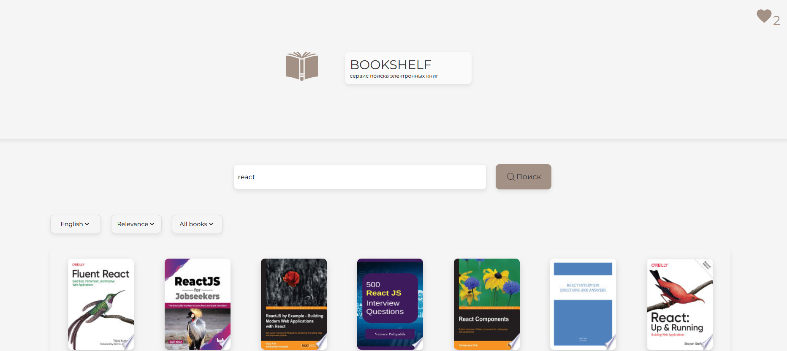

# Bookshelf

E-books search and viewing app integrated with [Google Books API](https://developers.google.com/books).

[README на русском](./README.ru.md)

## Deployment

[Deploy](https://bookshelfsearch.netlify.app/)



## Technologies

- **TypeScript**
- **React**
- **React-Redux, Redux Toolkit** (**createAsyncThunk** for async requests, **redux-persist** for state persistence)
- **SCSS** (Sass)
- **Custom React Hooks**
- **React-router-dom**
- **Vite**
- **ESLint, Prettier**
- **Netlify**

## Features

- **Search for books** by title, author, or keywords
- **Sort results** by language, relevance, price, or text availability
- **View book details** (author, publisher, description)
- **Book preview** support
- External link to the book on Google Books
- Pagination
- Add books to **a favorites list** (stored in localStorage)
- **Calculate the total price of books** in the favorites list
- **Custom useFavorites hook** for managing favorites

## More details

### Routing

- Home page with search results
- "Favorites" page
- "Not Found" page

### State Management

- **Redux slices** for managing app state
- **createAsyncThunk** for API requests
- **redux-persist** to persist app state and favorites list

### Loading & Error Handling

- **Skeleton loader** for books while data is loading
- **Spinner** for favorites and book preview loading states
- Message when no books are found
- Message when there are no more books to display

### Performance Optimizations

- **Lazy loading** of pages
- **useMemo** for memoizing book thumbnails

### Styling and Responsiveness

- Responsive layout down to 360px screen width (SCSS Modules)
- Responsive modal windows

### Error Handling in API

- **Duplicate books returned by the API**: filtered out in the reducer by book ID

- **Missing items field in API response when books run out**: additional **NO_MORE_BOOKS status** introduced to handle this scenario gracefully

## How to start project

in the project directory enter:

```bash
npm install
```

create .env file in the root directory and specify:

```
VITE_GOOGLE_BOOKS_API_KEY=your_api_key
```

and then run in dev mode:

```bash
npm run dev
```

build the project:

```bash
npm run build
```

production mode:

```bash
npm run serve
```
