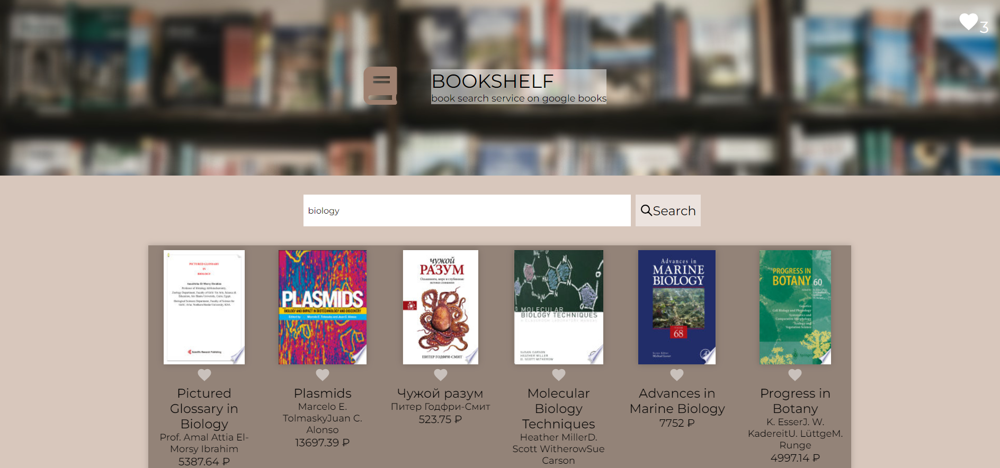

# Bookshelf

TS + React + Redux Toolkit.  
<br />
App for searching e-books. Features: sorting books by cost, language of writing, completeness of text, date of publication. Viewing a book description, going to a book page, saving books to your favorites list.  
<br />
Приложение для поиска электронных книг. Возможности: сортировка книг по стоимости, языку написания, полноте текста, дате публикации. Просмотр описания книги, переход на страницу книги, сохранение книг в список избранного.  
<br />
Link: https://bookshelfsearch.netlify.app/

## Preview



## How to start project

in the project directory enter:

```js
npm install
```

and then

```js
npm run dev
```
