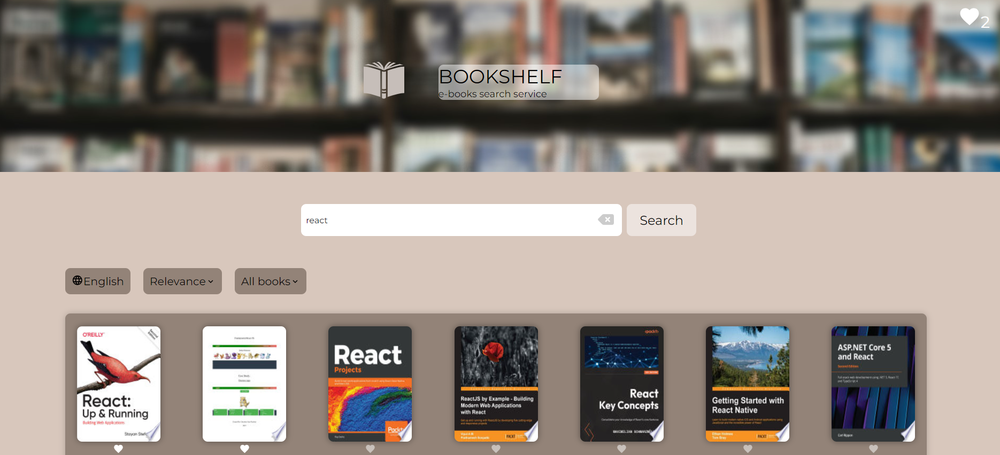

# Bookshelf

Приложение для поиска и просмотра электронных книг, интегрированное с [Google Books API](https://developers.google.com/books).

## Deployment & Live Demo

[Deploy](https://bookshelfsearch.netlify.app/)



## Technologies Used

- Typescript
- React
- React-Redux, Redux Toolkit (createAsyncThunk для асинхронных запросов, redux-persist для сохранения состояния)
- SCSS (Sass)
- Custom React Hooks
- React-router-dom
- Vite
- ESLint, Prettier
- Netlify

## Features

- Поиск книг по названию, автору или ключевым словам
- Сортировка результатов по языку, релевантности, цене, полноте текста
- Просмотр информации о книге (автор, издательство, описание, etc.)
- Предпросмотр книги
- Переход на страницу книги на сервисе Google Books
- Пагинация
- Сохранение книг в список избранного (localStorage)
- Подсчёт стоимости книг в списке избранного
- Кастомный хук useFavorites для управления списком избранного
- Собственный UI

## More details

### Routing

- Главная страница с результатами поиска
- Страница "Favorites"
- Страница "Not found"

### State Management

- slices для организации состояний
- createAsyncThunk для запросов к API
- redux-persist для сохранения состояния и списка избранного

### Loading & Error Handling

- Скелетон при загрузке книг
- Спиннер при загрузке списка избранного и предпросмотра книги
- Сообщение, если книги не найдены
- Сообщение, если книги по запросу закончились

### Performance Optimizations

- Lazy Loading страниц
- useMemo для мемоизации обложек (thumbnails) книг

### Styling and Responsiveness

- Адаптивная вёрстка до 360px ширины экрана (SCSS-модули)
- Миксины (модальное окно, дропдаун, кнопка)
- Раскрывающиеся списки при наведении
- Адаптив для модальных окон

### Error Handling in API

- **API возвращает дубликаты книг**. Реализована фильтрация книг с одинаковым id на уровне редьюсера.

- **API исключает массив items из ответа, если книги заканчиваются**. Добавлен дополнительный статус 'NO_MORE_BOOKS' для обработки этого случая.

- **У бесплатных книг отсутствует объект listPrice со свойством стоимости**. Для них отображается надпись 'Free', цена устанавливается в 0.

- **В ответе API могут отсутствовать данные**. Отсутствующие данные заменяются значениями по умолчанию.

## How to start project

in the project directory enter:

```js
npm install
```

and then run in dev mode:

```js
npm run dev
```

build the project:

```js
npm run build
```

production mode:

```js
npm run serve
```
